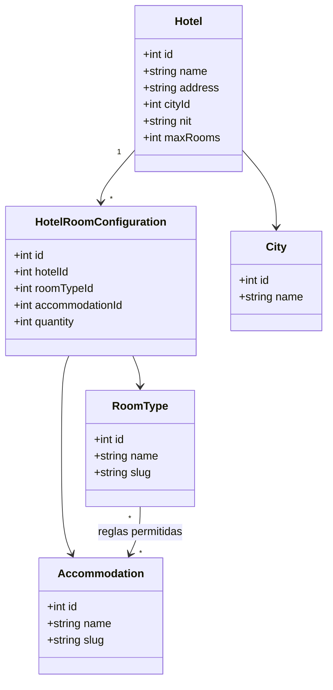
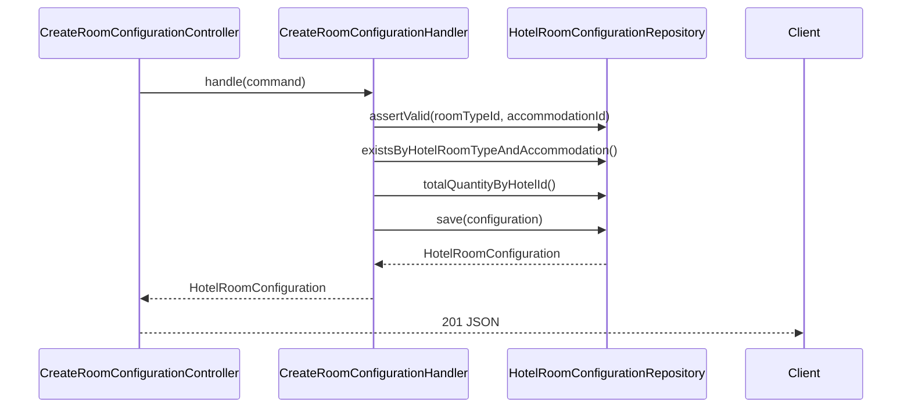
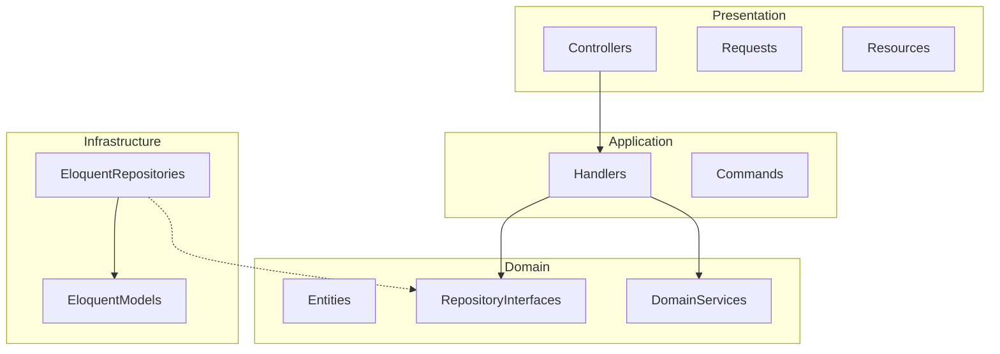

# Diagramas UML

## Diagrama de clases (dominio)

## Diagrama de secuencia — Crear configuración de habitación

## Diagrama de capas

## Patrones aplicados

- **Repository**: abstrae persistencia en `Domain`, implementación en `Infrastructure`
- **Use Case / Command Handler**: un handler por operación de negocio
- **Single Responsibility**: un controlador por acción HTTP
- **Dependency Inversion**: handlers dependen de interfaces, no de Eloquent
